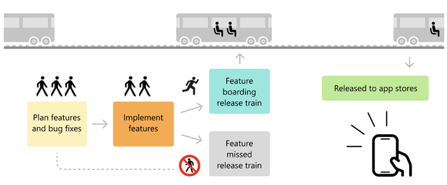

## Explicação do Workflow

1. Input type:
    - Define o tipo de atualização da versão:
        - patch: Incrementa apenas o número de patch.
        - minor: Incrementa o número secundário e zera o patch.
        - major: Incrementa o número principal e zera os outros.

2. Atualização da Versão:
    - Lê a versão atual no package.json usando Node.js.
    - Divide a versão em major, minor e patch para atualização conforme o tipo especificado.

3. Manipulação do package.json:
    - Atualiza a versão no package.json usando o comando jq.

4. Criação e Push da Branch:
    - Nomeia a branch no formato release/v{nova_versão}.
    - Faz commit das mudanças e envia a branch para o repositório remoto.

## Como Executar

1. Vá até a aba Actions no GitHub e escolha o workflow.
2. Clique em Run workflow.
3. Escolha o tipo de atualização: patch, minor, ou major.

## Resultado

1. A versão no package.json será incrementada automaticamente.
2. Um commit será feito com a mensagem: chore: bump version to x.y.z.
3. Uma nova branch chamada release/vx.y.z será criada e enviada ao repositório remoto.

 

## Release Train

 

 

## Fluxo Completo

1. Define-se o prazo ou quais features vão entrar na release.
2. A Action:
    - Lê a versão do package.json.
    - Incrementa a versão (patch, minor, ou major).
    - Cria a branch release/vx.y.z.
    - Atualiza o package.json e faz commit.
    - (Opcional) Cria um Pull Request para integrar a branch de release.
3. Equipe revisa as branches (feature/fix/etc...) que irão compor a release.
4. Após o merge, um novo workflow publica o release automaticamente.

### Benefícios

- Previsibilidade: Releases regulares aumentam a confiança do time e dos stakeholders.
- Automação: Minimiza o esforço manual com integração contínua.
- Flexibilidade: Funcionalidades não finalizadas simplesmente aguardam o próximo ciclo.